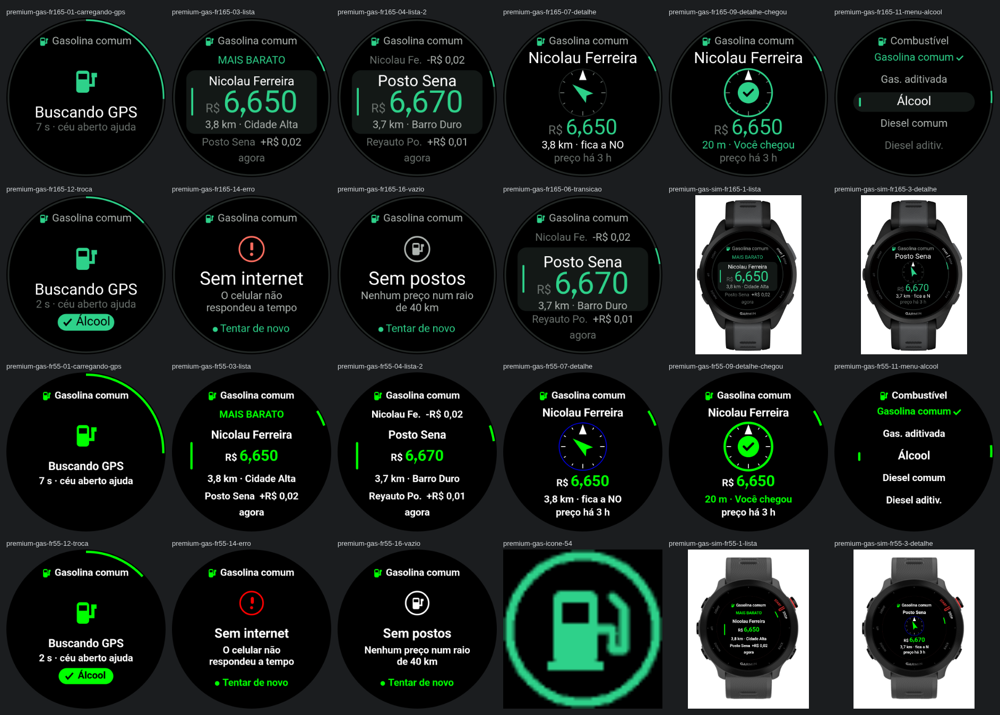
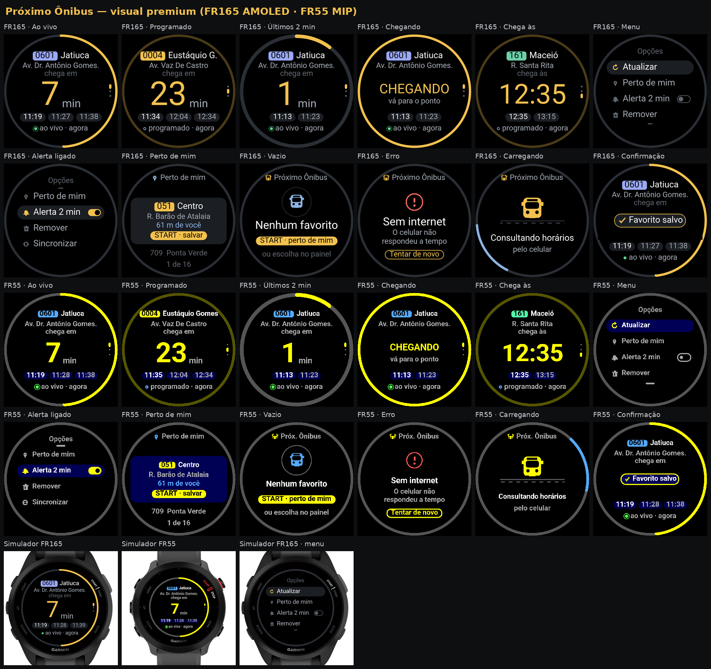
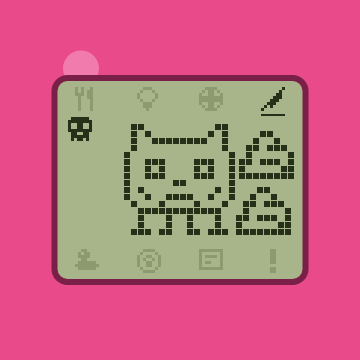
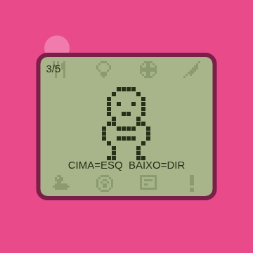
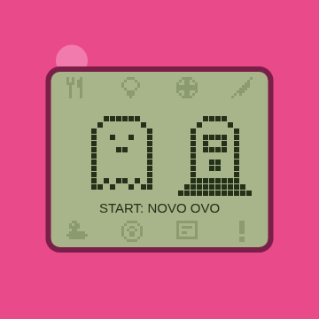

# ⌚ Garmin Connect IQ Apps + Garmin Connect PWA — apps grátis para relógios Garmin (Forerunner 165, Forerunner 55)

**Free & open-source Garmin watch apps (Connect IQ / Monkey C) and a Garmin Connect web dashboard.**
Apps gratuitos e de código aberto para relógios Garmin — preço de gasolina perto de você, horário de ônibus ao vivo, contador de musculação, sono, mostrador completo, walkie-talkie, bichinho virtual e Omnitrix — mais um painel web (PWA) em PHP + MySQL que sincroniza sua conta Garmin Connect e cria relatórios que o relógio não mostra.

[](https://developer.garmin.com/connect-iq/)
[](#-apps-para-relógios-garmin--garmin-watch-apps)
[](#-download--instalação-dos-apps)
[](LICENSE)
[](https://github.com/alequizao/garmin-connect-pwa/releases/latest)

- **Demonstração em produção:** https://alequizao.com/garmin/
- **Download dos apps (.prg):** [Releases](https://github.com/alequizao/garmin-connect-pwa/releases/latest)
- **Stack:** Monkey C / Connect IQ SDK · PHP 8.3 · MySQL/MariaDB · JavaScript puro · Leaflet · Python 3 · Node.js
- **Licença:** MIT — use, adapte e contribua

## ⌚ Apps para relógios Garmin · Garmin watch apps

| App | O que faz | What it does | Relógios |
|---|---|---|---|
| ⛽ **Gasolina Perto** | Postos mais baratos perto de você, com seta até o posto | Cheapest gas stations nearby with a compass arrow | FR165 · FR165M · FR55 |
| 🚌 **Próximo Ônibus** | "Chega em X min" ao vivo, favoritos e alerta 2 min antes | Live bus arrival countdown, favorites, 2-min alert | FR165 · FR165M · FR55 |
| 🏋️ **Força** | Contador automático de repetições na musculação | Strength training rep counter | FR165 · FR165M · FR55 |
| 😴 **Sono** | Análise da noite 100% offline no relógio | Offline sleep analysis | FR165 · FR165M · FR55 |
| 🧭 **Painel Total** | Mostrador com hora, FC, passos, clima e mais | All-in-one watch face | FR165 · FR165M |
| 📍 **Rastreador** | GPS, bateria e FC ao vivo no Traccar | Live GPS tracker for Traccar | 159 modelos |
| 📻 **Walkie-Talkie** | Canais, mensagens rápidas e SOS | Message walkie-talkie with SOS | 159 modelos |
| 🍺 **ME MIMEI** | Quantos lanches cabem nas calorias do dia | Snacks vs. active calories | 159 modelos |
| 🥚 **Bichinho Virtual** | Bichinho virtual estilo 1996 | Virtual pet (Tamagotchi-style) | 159 modelos |
| 🟢 **Omnitrix** | Omnitrix interativo + mostrador | Ben 10 Omnitrix app + watch face | 159 modelos |

Todos são **leves em memória** (vetoriais, sem fontes extras) e com visual premium para AMOLED e MIP.

<p align="center">
  
</p>
<p align="center">
  
</p>

## 📥 Download / instalação dos apps

1. Baixe o `.prg` do seu relógio em **[Releases](https://github.com/alequizao/garmin-connect-pwa/releases/latest)** (ex.: `GasolinaPerto-fr165.prg`).
2. Ligue o relógio no computador pelo cabo USB e copie o arquivo para a pasta **`GARMIN/APPS`**.
3. Desconecte: o app aparece em **Aplicativos**. Apps que usam internet precisam do celular pareado com o Garmin Connect.

*English:* download the `.prg` for your watch from Releases, copy it to `GARMIN/APPS` over USB, and open it from the Apps list. Or build from source with the Connect IQ SDK (`monkeyc -f <app>/monkey.jungle -d fr165 -y your_key.der`).

## 🖥️ Painel web (PWA)

Visual inspirado no app oficial (tela "Meu dia"), com layout de celular e de computador, tempo real por AJAX e apps Connect IQ gerados automaticamente para 159 modelos de relógio.

<p align="center">
  
</p>

## 📸 Telas do sistema

| Meu dia | Relógio | Atividade |
|:---:|:---:|:---:|
|  |  |  |

| Relatórios | Mapa | Walkie-Talkie |
|:---:|:---:|:---:|
|  |  |  |

| ME MIMEI | | |
|:---:|:---:|:---:|
|  | | |

<details>
<summary><b>Mais telas (celular e computador)</b></summary>

| Apps (gerar app do relógio) | Login | Atividades |
|:---:|:---:|:---:|
|  |  |  |

| Saúde | Desempenho | Gravar |
|:---:|:---:|:---:|
|  |  |  |

| Perfil e integrações | Mapa (computador) |
|:---:|:---:|
|  |  |

| Relógio (computador) | Relatórios (computador) |
|:---:|:---:|
|  |  |

</details>

> As capturas usam dados reais, com mapas em escala de cidade e número de série/coordenadas mascarados.

## ✨ Funcionalidades

### Sincronização com a Garmin
- Conecta com **e-mail e senha do Garmin Connect** (sem API paga) e sincroniza sozinho: sincronização leve a cada minuto e completa a cada 30 min, com **tempos aleatórios** para evitar bloqueio.
- Importa atividades com rota GPS, frequência cardíaca, cadência e elevação; passos, sono por fases, estresse, Body Battery, SpO2, respiração, HRV, peso, hidratação, andares, recordes, previsões de prova, idade fitness e dados do aparelho (firmware, recursos, última sincronização).

### Relatórios que o relógio não mostra
Forma × fadiga (modelo de Banister), **risco de lesão (ACWR)**, eficiência aeróbica e **desacoplamento cardíaco** por corrida, **melhores esforços reais medidos no GPS**, tempo em zonas de FC por semana, mapa de calor dia × hora, regularidade do sono e débito de sono, HRV × FC de repouso, **correlações** (sono × desempenho, temperatura × ritmo…), projeções de km no mês/ano e destaques automáticos em texto.

### Rastreamento ao vivo e Traccar
- **App "Rastreador" para o relógio** (Connect IQ): envia bateria real, frequência cardíaca, passos, Body Battery, estresse e GPS — a cada 30 s com o app aberto e a cada 5 min em segundo plano.
- **LiveTrack**: lê os convites da Garmin por e-mail e acompanha a sessão ao vivo.
- Tudo chega ao **[Traccar](https://www.traccar.org/)** (protocolo OsmAnd) no dispositivo de cada pessoa, criado automaticamente.
- Mapa com satélite + trânsito, trilha das últimas 24 h e todas as rotas.

### 📻 Walkie-Talkie Alequizão
- Canais com código de convite; mensagens rápidas configuráveis no site (inserir, editar, reordenar, apagar), texto livre, **"Chamar atenção"** (vibra e apita por 10 s) e **SOS com localização**.
- Chat no site com **microfone** (a fala do celular vira texto) e **notificações Web Push** — o Garmin Connect espelha a notificação do celular no relógio.
- Chave de integração por canal para outros sistemas publicarem avisos (ex.: lembretes).

### 🍺 ME MIMEI
Inspirado no CheersCore: mostra no relógio **quantos lanches cabem nas calorias ativas do dia** (coxinha, pastel, acarajé, tapioca, cuscuz, cerveja long neck…), cada um com **ícone 3D**. A lista é editada no site (inserir, editar, reordenar, apagar) e o relógio atualiza sozinho. Busca de calorias estilo YAZIO na **tabela TACO**, numa base de lanches populares e no **Open Food Facts**; ícones em estilo Fluent Emoji 3D (MIT) e gerados por IA para pratos regionais.

### 🥚 Bichinho Virtual
Bichinho virtual no estilo dos aparelhinhos de 1996, feito em pixel art desenhada por código (nada de imagens). **1 dia real = 1 ano de vida**: o ovo choca em 5 minutos, vira bebê, criança, adolescente e adulto — e **qual adulto ele vira depende do seu cuidado**. São 13 personagens, 8 ícones (comer, luz, brincar, remédio, limpar, bronca, status e atenção), disciplina com bronca na birra, doença que exige 2 doses de remédio, peso em gramas, jogo de adivinhar o lado, sono com horário próprio de cada personagem e morte por fome, doença ou velhice. Toca sons pelo alto-falante do relógio e acende a tela nos avisos. Tudo continua correndo com o app fechado: o tempo é recalculado ao abrir. Jogável também no site, com a mesma lógica e os mesmos desenhos.

| Ovo | Adulto | Jogo | Fim |
|:---:|:---:|:---:|:---:|
|  |  |  |  |

### 🟢 Omnitrix (relógio alienígena)
App interativo: START abre o mostrador, cima e baixo giram entre **59 silhuetas**, e START transforma — com clarão, raios girando, vibração e sons. A transformação dura 10 minutos, com bipe e piscar vermelho nos últimos 10 segundos, e depois o aparelho recarrega por 1 minuto. Acompanha um mostrador de relógio no mesmo tema.

### ⛽ Gasolina Perto
Os postos mais baratos perto de você (preços da SEFAZ-AL), com distância, **cor do preço** (verde = mais barato), diferença para o mais barato, **rosa-dos-ventos** apontando para o posto, aviso "Você chegou", troca de combustível e glance com o menor preço. Anel de progresso na borda e transições suaves. Leve: ~24 KB no Forerunner 55.

### 🚌 Próximo Ônibus
Até 4 favoritos de linha + ponto, **"chega em X min" ao vivo** (GPS dos ônibus) ou pela tabela programada, com **anel de contagem regressiva na borda** que pulsa nos 2 últimos minutos, próximos horários em chips, selo colorido por linha, "Perto de mim" e alerta com vibração 2 min antes. Favoritos configuráveis no painel. Leve: ~33 KB no Forerunner 55.

### 🏋️ Força · 😴 Sono · 🧭 Painel Total
Contador de repetições para musculação, análise da noite 100% offline no relógio e um mostrador com hora, FC, passos, clima e mais na mesma tela.

### Apps do relógio gerados sob medida
Na aba **Apps**, cada pessoa digita o nome do dispositivo e o modelo do relógio (lista com 159 modelos Garmin), e o servidor **compila o `.prg` com a chave dela embutida** em cerca de 30 s.

### Strava
"Conectar com Strava" (OAuth), **envio de todos os treinos do relógio** (GPX com FC, cadência e altitude) com fila, progresso, envio automático dos novos e respeito aos limites da API.

### Conta e segurança
Login com limite de tentativas, sessão renovada no login, **"Esqueci minha senha" por e-mail** (link de 1 hora, uso único), PWA instalável, modo offline para atividades gravadas pelo celular.

## 🏗️ Arquitetura

```
├── index.php, app.js, style.css, sw.js, manifest.json   # PWA (telas, tempo real, service worker)
├── api.php                                              # API JSON (?acao=…)
├── relogio.php                                          # recebe o app Rastreador → banco + Traccar
├── walkie.php                                           # endpoint do app Walkie-Talkie (+ integração)
├── strava.php, lib_email.php, lib_push.php              # OAuth Strava, SMTP, Web Push (VAPID)
├── install.php, config.example.php                      # instalação
├── servicos/                                            # rodam no servidor (cron/systemd)
│   ├── sync.py, extra.py         # sincronização Garmin (leve/completa) e coleta completa + análises
│   ├── traccar.py                # rotas das atividades → Traccar
│   ├── livetrack_mail.py, livetrack.js   # LiveTrack por e-mail → Traccar em tempo real
│   ├── appbuilder.py             # fila que compila os apps Connect IQ por pessoa/modelo
│   └── conf_garmin.py, systemd/, cron/, requirements.txt, package.json
├── relogio-connectiq/                                   # fonte do app Rastreador (Monkey C)
├── walkie-connectiq/                                    # fonte do app Walkie-Talkie (Monkey C)
├── mimei-connectiq/                                     # fonte do app ME MIMEI (Monkey C)
├── bichinho-connectiq/                                  # fonte do Bichinho Virtual (Monkey C)
├── omnitrix-connectiq/                                  # fonte do Omnitrix interativo (Monkey C)
├── ben10-mostrador-connectiq/                           # fonte do mostrador do mesmo tema (Monkey C)
├── gasolina-connectiq/                                  # fonte do Gasolina Perto (Monkey C)
├── onibus-connectiq/                                    # fonte do Próximo Ônibus (Monkey C)
├── forca-connectiq/  sono-connectiq/  painel-connectiq/ # Força, Sono e Painel Total (Monkey C)
│   (servicos/strava_upload.py envia os treinos ao Strava)
└── docs/                                                # schema.sql, exemplo do .ini, instalação, telas
```

## 🚀 Instalação

Guia completo em **[docs/INSTALACAO.md](docs/INSTALACAO.md)**. Resumo:

```bash
# 1) site
cp config.example.php config.php        # banco, APP_URL, SMTP e Traccar (opcional)
php install.php                          # cria as tabelas e o primeiro acesso (senha sorteada)

# 2) serviços (Python/Node) — fora da pasta pública
sudo cp docs/garmin-alequizao.ini.example /etc/garmin-alequizao.ini && sudo chmod 600 /etc/garmin-alequizao.ini
python3 -m venv /opt/garmin-sync/venv && /opt/garmin-sync/venv/bin/pip install -r servicos/requirements.txt
sudo cp servicos/cron/garmin-sync /etc/cron.d/ && sudo cp servicos/systemd/*.service /etc/systemd/system/
```

Para gerar os apps do relógio é preciso o **Connect IQ SDK** (gratuito, com conta de desenvolvedor Garmin) e uma chave `.der` própria.

## ⚠️ Limitações conhecidas

- A integração com a Garmin usa a biblioteca não oficial [`garminconnect`](https://github.com/cyberjunky/python-garminconnect); contas com verificação em duas etapas não funcionam no modo automático.
- Relógios Garmin **não permitem voz** em apps de terceiros (sem acesso a microfone/alto-falante): o walkie-talkie é de mensagens.
- Apps Connect IQ instalados por cabo não se atualizam sozinhos; para atualização automática é preciso publicá-los na Connect IQ Store.
- Em segundo plano o relógio só pode rodar a cada 5 minutos (limite da plataforma).
- O Strava só permite conexão por OAuth: a pessoa toca em "Conectar com Strava" e entra na página do próprio Strava (não há login por usuário e senha via API).

## 👨‍💻 Desenvolvedor

Sistema desenvolvido por **Alequizao**.

- **E-mail:** alequizao.dev@gmail.com
- **GitHub:** [@alequizao](https://github.com/alequizao)

Quer um sistema como este para o seu negócio? Entre em contato.

---

Distribuído sob a licença **MIT** — veja [LICENSE](LICENSE). Garmin, Garmin Connect, Forerunner e Connect IQ são marcas da Garmin Ltd.; este projeto não é afiliado à Garmin.

**Palavras-chave / keywords:** Garmin apps, Garmin watch apps, Connect IQ apps, Connect IQ app open source, Monkey C examples, Garmin Forerunner 165 apps, Garmin Forerunner 55 apps, Garmin gas prices app, Garmin bus app, Garmin transit app, Garmin strength rep counter, Garmin sleep app, Garmin watch face, Garmin tamagotchi, Garmin walkie talkie, apps para relógio Garmin, aplicativos Garmin grátis, app de gasolina Garmin, horário de ônibus Maceió, Garmin Connect, relógio Garmin, Forerunner 165, Forerunner 55, Connect IQ, Monkey C, PWA, PHP, MySQL, Traccar, rastreamento GPS, LiveTrack, walkie-talkie, Body Battery, HRV, VO2 max, ACWR, Strava, Web Push, dashboard de saúde, relatórios de corrida.
