# ⌚ Garmin Connect PWA — painel de saúde, rastreamento ao vivo e Walkie-Talkie para relógios Garmin

**Aplicativo web progressivo (PWA) em PHP + MySQL que sincroniza sua conta Garmin Connect, cria relatórios que o relógio não mostra, envia a posição e a bateria do relógio para o Traccar e ainda transforma relógios Garmin em um walkie-talkie de mensagens.**

Visual inspirado no app oficial (tela "Meu dia"), com layout de celular e de computador, tempo real por AJAX e apps Connect IQ gerados automaticamente para 159 modelos de relógio.

- **Demonstração em produção:** https://alequizao.com/garmin/
- **Stack:** PHP 8.3 · MySQL/MariaDB · JavaScript puro (sem framework) · Leaflet · Python 3 (sincronização) · Node.js + Puppeteer (LiveTrack) · Monkey C / Connect IQ SDK
- **Licença:** MIT — use, adapte e contribua

<p align="center">
  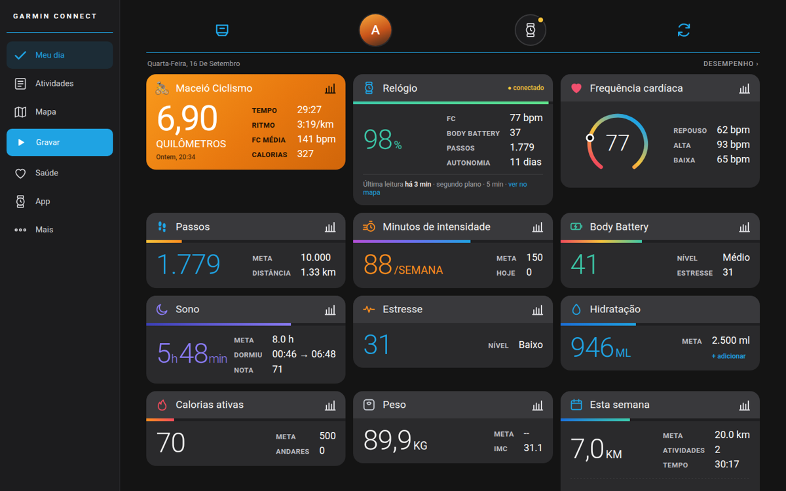
</p>

## 📸 Telas do sistema

| Meu dia | Relógio | Atividade |
|:---:|:---:|:---:|
| 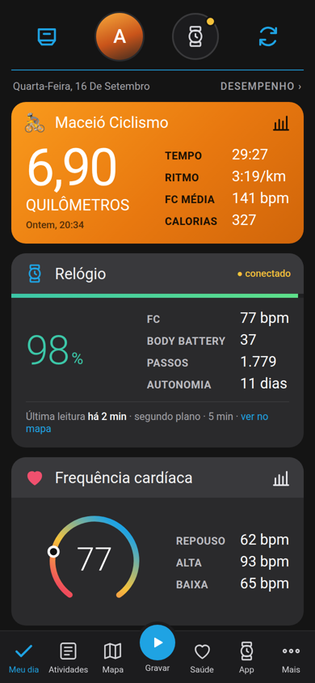 | 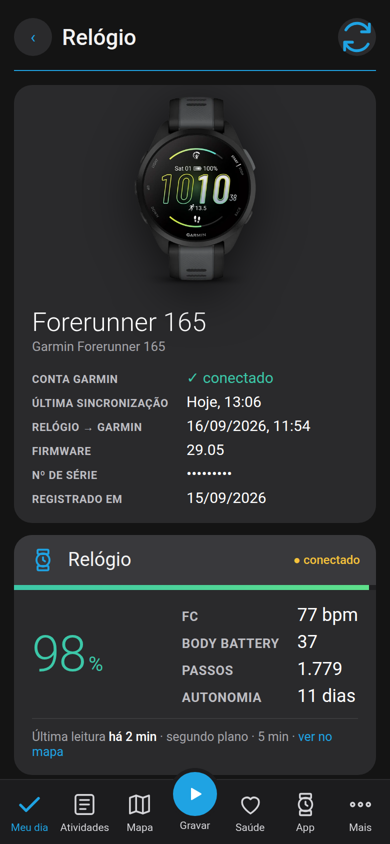 | 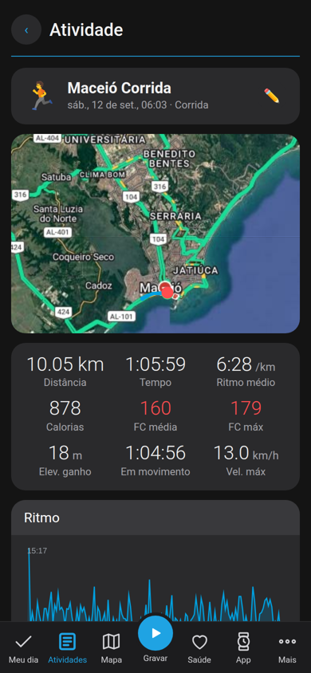 |

| Relatórios | Mapa | Walkie-Talkie |
|:---:|:---:|:---:|
| 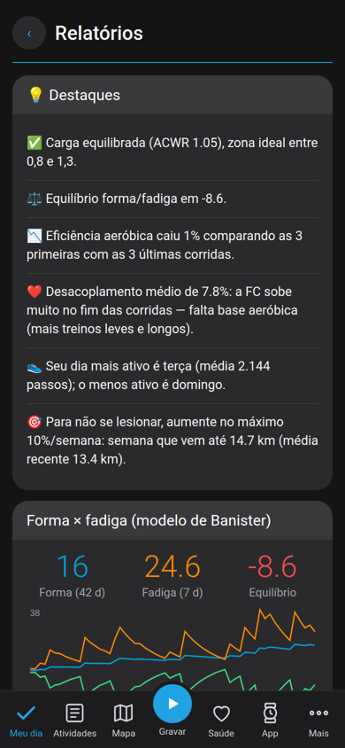 | 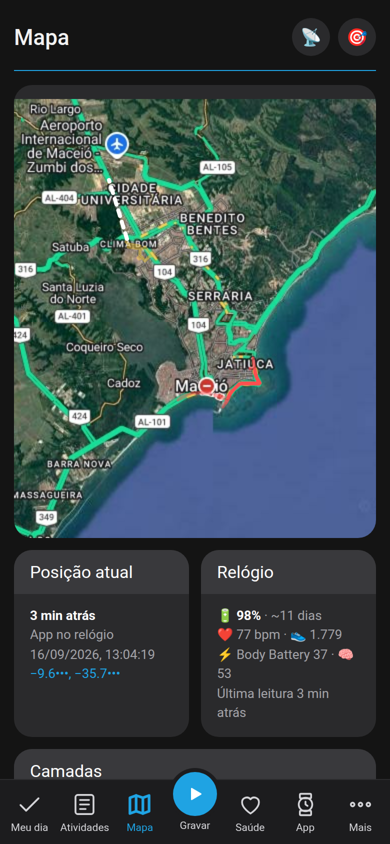 | 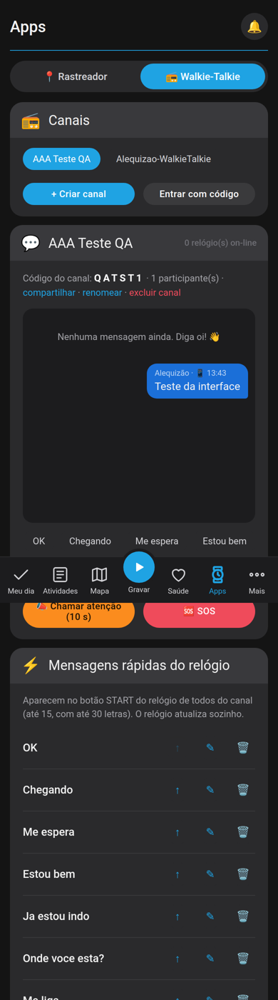 |

| ME MIMEI | | |
|:---:|:---:|:---:|
| 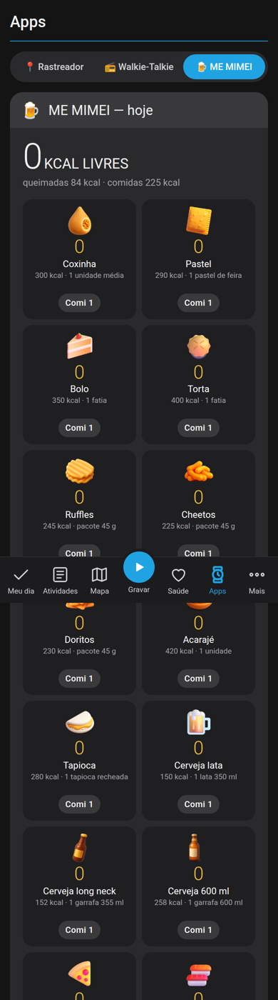 | | |

<details>
<summary><b>Mais telas (celular e computador)</b></summary>

| Apps (gerar app do relógio) | Login | Atividades |
|:---:|:---:|:---:|
| 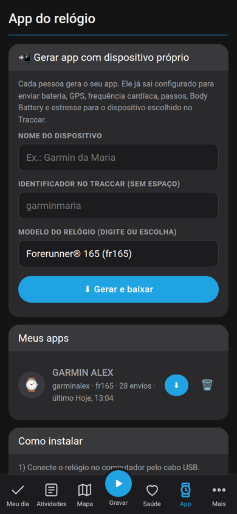 | 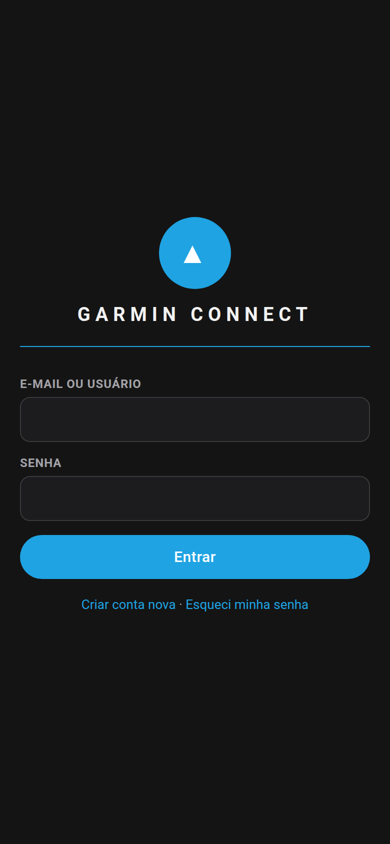 | 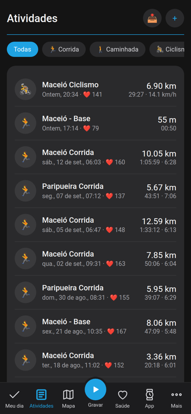 |

| Saúde | Desempenho | Gravar |
|:---:|:---:|:---:|
| 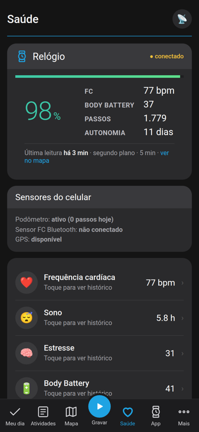 | 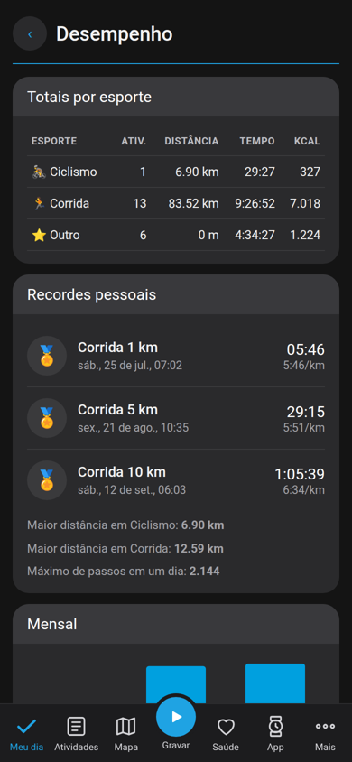 | 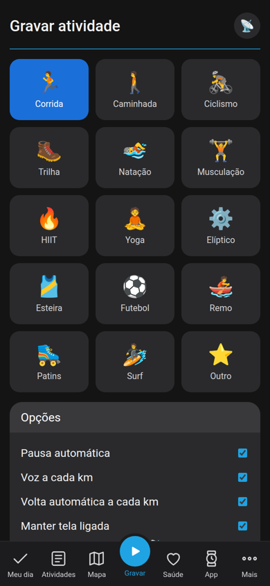 |

| Perfil e integrações | Mapa (computador) |
|:---:|:---:|
| 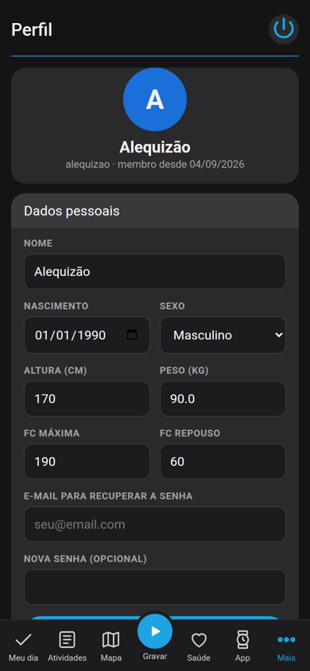 | 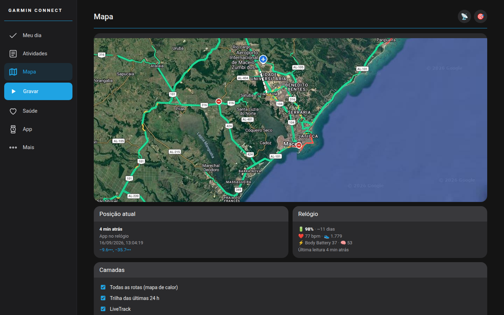 |

| Relógio (computador) | Relatórios (computador) |
|:---:|:---:|
| 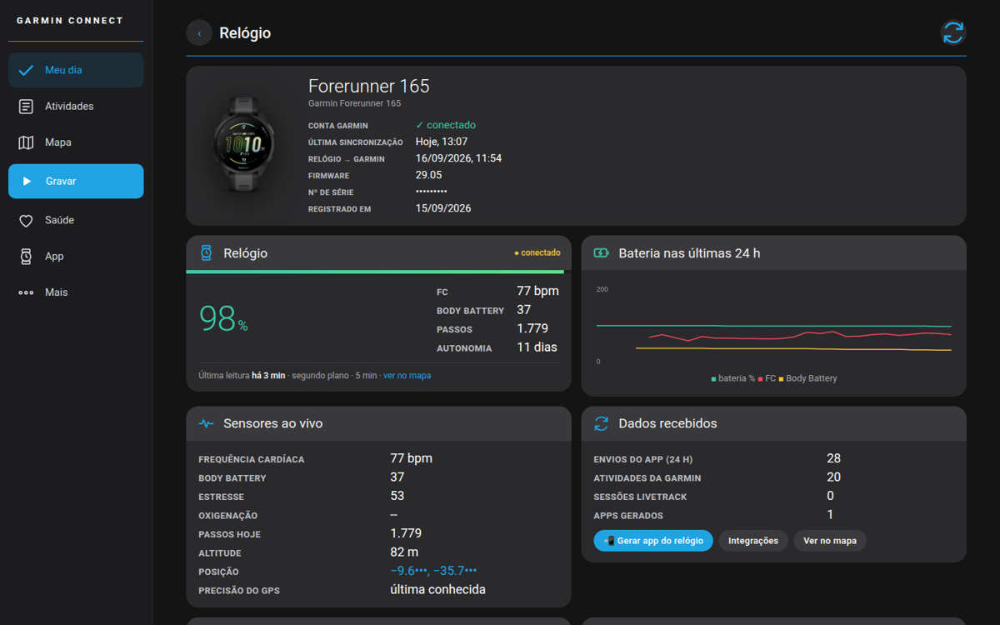 | 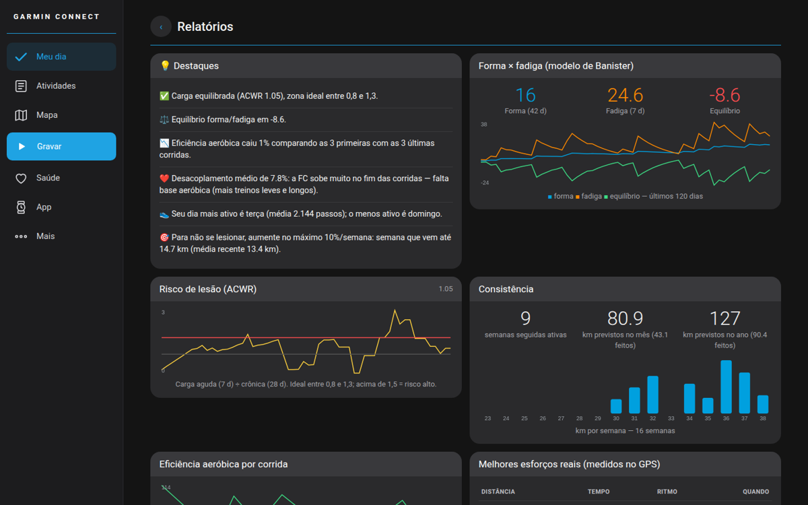 |

</details>

> As capturas usam dados reais, com mapas em escala de cidade e número de série/coordenadas mascarados.

## ✨ Funcionalidades

### Sincronização com a Garmin
- Conecta com **e-mail e senha do Garmin Connect** (sem API paga) e sincroniza sozinho: sincronização leve a cada minuto e completa a cada 30 min, com **tempos aleatórios** para evitar bloqueio.
- Importa atividades com rota GPS, frequência cardíaca, cadência e elevação; passos, sono por fases, estresse, Body Battery, SpO2, respiração, HRV, peso, hidratação, andares, recordes, previsões de prova, idade fitness e dados do aparelho (firmware, recursos, última sincronização).

### Relatórios que o relógio não mostra
Forma × fadiga (modelo de Banister), **risco de lesão (ACWR)**, eficiência aeróbica e **desacoplamento cardíaco** por corrida, **melhores esforços reais medidos no GPS**, tempo em zonas de FC por semana, mapa de calor dia × hora, regularidade do sono e débito de sono, HRV × FC de repouso, **correlações** (sono × desempenho, temperatura × ritmo…), projeções de km no mês/ano e destaques automáticos em texto.

### Rastreamento ao vivo e Traccar
- **App "Rastreador" para o relógio** (Connect IQ): envia bateria real, frequência cardíaca, passos, Body Battery, estresse e GPS — a cada 30 s com o app aberto e a cada 5 min em segundo plano.
- **LiveTrack**: lê os convites da Garmin por e-mail e acompanha a sessão ao vivo.
- Tudo chega ao **[Traccar](https://www.traccar.org/)** (protocolo OsmAnd) no dispositivo de cada pessoa, criado automaticamente.
- Mapa com satélite + trânsito, trilha das últimas 24 h e todas as rotas.

### 📻 Walkie-Talkie Alequizão
- Canais com código de convite; mensagens rápidas configuráveis no site (inserir, editar, reordenar, apagar), texto livre, **"Chamar atenção"** (vibra e apita por 10 s) e **SOS com localização**.
- Chat no site com **microfone** (a fala do celular vira texto) e **notificações Web Push** — o Garmin Connect espelha a notificação do celular no relógio.
- Chave de integração por canal para outros sistemas publicarem avisos (ex.: lembretes).

### 🍺 ME MIMEI
Inspirado no CheersCore: mostra no relógio **quantos lanches cabem nas calorias ativas do dia** (coxinha, pastel, acarajé, tapioca, cuscuz, cerveja long neck…), cada um com **ícone 3D**. A lista é editada no site (inserir, editar, reordenar, apagar) e o relógio atualiza sozinho. Busca de calorias estilo YAZIO na **tabela TACO**, numa base de lanches populares e no **Open Food Facts**; ícones em estilo Fluent Emoji 3D (MIT) e gerados por IA para pratos regionais.

### Apps do relógio gerados sob medida
Na aba **Apps**, cada pessoa digita o nome do dispositivo e o modelo do relógio (lista com 159 modelos Garmin), e o servidor **compila o `.prg` com a chave dela embutida** em cerca de 30 s.

### Strava
"Conectar com Strava" (OAuth), **envio de todos os treinos do relógio** (GPX com FC, cadência e altitude) com fila, progresso, envio automático dos novos e respeito aos limites da API.

### Conta e segurança
Login com limite de tentativas, sessão renovada no login, **"Esqueci minha senha" por e-mail** (link de 1 hora, uso único), PWA instalável, modo offline para atividades gravadas pelo celular.

## 🏗️ Arquitetura

```
├── index.php, app.js, style.css, sw.js, manifest.json   # PWA (telas, tempo real, service worker)
├── api.php                                              # API JSON (?acao=…)
├── relogio.php                                          # recebe o app Rastreador → banco + Traccar
├── walkie.php                                           # endpoint do app Walkie-Talkie (+ integração)
├── strava.php, lib_email.php, lib_push.php              # OAuth Strava, SMTP, Web Push (VAPID)
├── install.php, config.example.php                      # instalação
├── servicos/                                            # rodam no servidor (cron/systemd)
│   ├── sync.py, extra.py         # sincronização Garmin (leve/completa) e coleta completa + análises
│   ├── traccar.py                # rotas das atividades → Traccar
│   ├── livetrack_mail.py, livetrack.js   # LiveTrack por e-mail → Traccar em tempo real
│   ├── appbuilder.py             # fila que compila os apps Connect IQ por pessoa/modelo
│   └── conf_garmin.py, systemd/, cron/, requirements.txt, package.json
├── relogio-connectiq/                                   # fonte do app Rastreador (Monkey C)
├── walkie-connectiq/                                    # fonte do app Walkie-Talkie (Monkey C)
├── mimei-connectiq/                                     # fonte do app ME MIMEI (Monkey C)
│   (servicos/strava_upload.py envia os treinos ao Strava)
└── docs/                                                # schema.sql, exemplo do .ini, instalação, telas
```

## 🚀 Instalação

Guia completo em **[docs/INSTALACAO.md](docs/INSTALACAO.md)**. Resumo:

```bash
# 1) site
cp config.example.php config.php        # banco, APP_URL, SMTP e Traccar (opcional)
php install.php                          # cria as tabelas e o primeiro acesso (senha sorteada)

# 2) serviços (Python/Node) — fora da pasta pública
sudo cp docs/garmin-alequizao.ini.example /etc/garmin-alequizao.ini && sudo chmod 600 /etc/garmin-alequizao.ini
python3 -m venv /opt/garmin-sync/venv && /opt/garmin-sync/venv/bin/pip install -r servicos/requirements.txt
sudo cp servicos/cron/garmin-sync /etc/cron.d/ && sudo cp servicos/systemd/*.service /etc/systemd/system/
```

Para gerar os apps do relógio é preciso o **Connect IQ SDK** (gratuito, com conta de desenvolvedor Garmin) e uma chave `.der` própria.

## ⚠️ Limitações conhecidas

- A integração com a Garmin usa a biblioteca não oficial [`garminconnect`](https://github.com/cyberjunky/python-garminconnect); contas com verificação em duas etapas não funcionam no modo automático.
- Relógios Garmin **não permitem voz** em apps de terceiros (sem acesso a microfone/alto-falante): o walkie-talkie é de mensagens.
- Apps Connect IQ instalados por cabo não se atualizam sozinhos; para atualização automática é preciso publicá-los na Connect IQ Store.
- Em segundo plano o relógio só pode rodar a cada 5 minutos (limite da plataforma).
- O Strava só permite conexão por OAuth: a pessoa toca em "Conectar com Strava" e entra na página do próprio Strava (não há login por usuário e senha via API).

## 👨‍💻 Desenvolvedor

Sistema desenvolvido por **Alequizao**.

- **E-mail:** alequizao.dev@gmail.com
- **GitHub:** [@alequizao](https://github.com/alequizao)

Quer um sistema como este para o seu negócio? Entre em contato.

---

Distribuído sob a licença **MIT** — veja [LICENSE](LICENSE). Garmin, Garmin Connect, Forerunner e Connect IQ são marcas da Garmin Ltd.; este projeto não é afiliado à Garmin.

**Palavras-chave:** Garmin Connect, relógio Garmin, Forerunner 165, Forerunner 55, Connect IQ, Monkey C, PWA, PHP, MySQL, Traccar, rastreamento GPS, LiveTrack, walkie-talkie, Body Battery, HRV, VO2 max, ACWR, Strava, Web Push, dashboard de saúde, relatórios de corrida.
